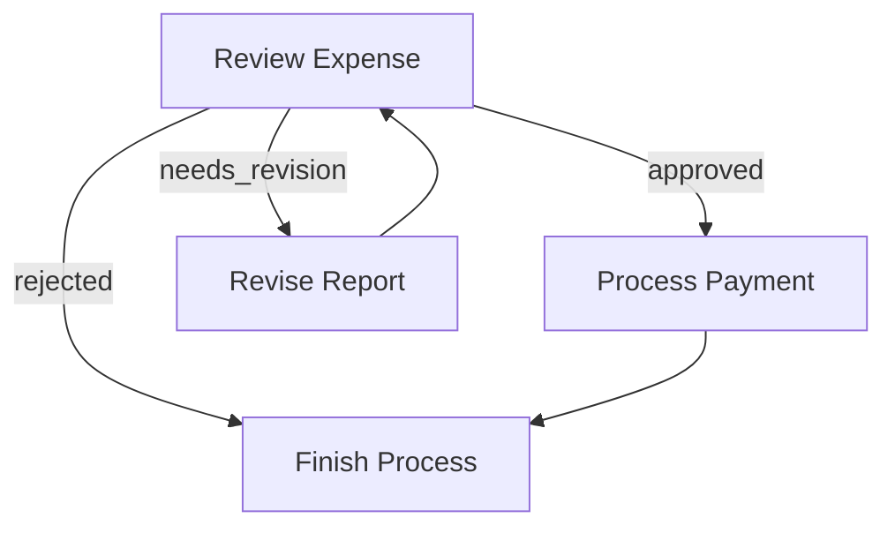
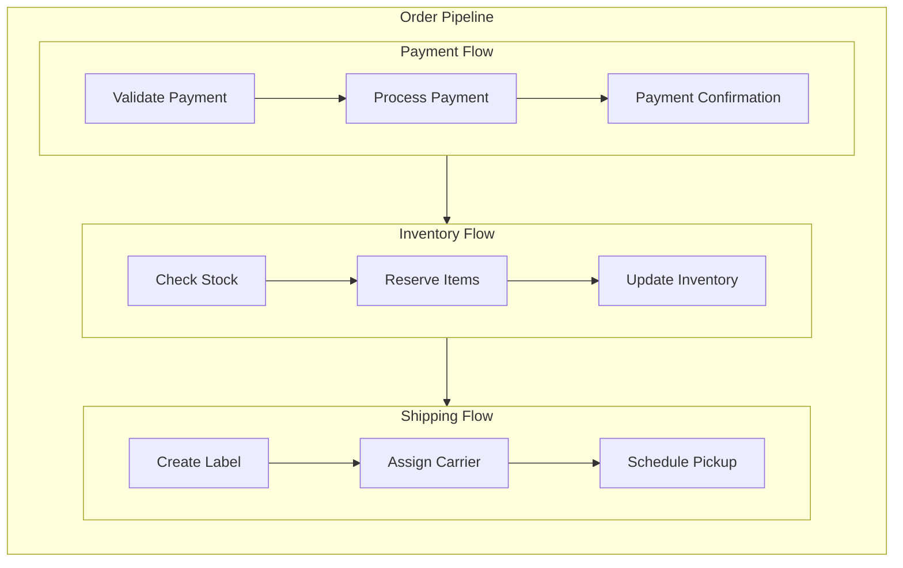

# Flow

A **Flow** orchestrates a graph of Nodes. You can chain Nodes in a sequence or create branching depending on the **Actions** returned from each Node's `post()`.

## 1. Action-based Transitions

Each Node's `post()` returns an **Action** string. By default, if `post()` doesn't return anything, we treat that as `"default"`.

You define transitions with the syntax:

1. **Basic default transition**: `node_a >> node_b`
   This means if `node_a.post()` returns `"default"`, go to `node_b`.
   (Equivalent to `node_a - "default" >> node_b`)

2. **Named action transition**: `node_a - "action_name" >> node_b`
   This means if `node_a.post()` returns `"action_name"`, go to `node_b`.

It's possible to create loops, branching, or multi-step flows.

## 2. Creating a Flow

A **Flow** begins with a **start** node. You call `Flow(start=some_node)` to specify the entry point. When you call `flow.run(shared)`, it executes the start node, looks at its returned Action from `post()`, follows the transition, and continues until there's no next node.

### Example: Simple Sequence

Here's a minimal flow of two nodes in a chain:

```python
node_a >> node_b
flow = Flow(start=node_a)
flow.run(shared)
```

- When you run the flow, it executes `node_a`.
- Suppose `node_a.post()` returns `"default"`.
- The flow then sees `"default"` Action is linked to `node_b` and runs `node_b`.
- `node_b.post()` returns `"default"` but we didn't define `node_b >> something_else`. So the flow ends there.

### Example: Branching & Looping

Here's a simple expense approval flow that demonstrates branching and looping. The `ReviewExpense` node can return three possible Actions:

- `"approved"`: expense is approved, move to payment processing
- `"needs_revision"`: expense needs changes, send back for revision
- `"rejected"`: expense is denied, finish the process

We can wire them like this:

```python
# Define the flow connections
review - "approved" >> payment        # If approved, process payment
review - "needs_revision" >> revise   # If needs changes, go to revision
review - "rejected" >> finish         # If rejected, finish the process

revise >> review   # After revision, go back for another review
payment >> finish  # After payment, finish the process

flow = Flow(start=review)
```

Let's see how it flows:

1. If `review.post()` returns `"approved"`, the expense moves to the `payment` node
2. If `review.post()` returns `"needs_revision"`, it goes to the `revise` node, which then loops back to `review`
3. If `review.post()` returns `"rejected"`, it moves to the `finish` node and stops



### Running Individual Nodes vs. Running a Flow

- `node.run(shared)`: Just runs that node alone (calls `prep->exec->post()`), returns an Action.
- `flow.run(shared)`: Executes from the start node, follows Actions to the next node, and so on until the flow can't continue.

> `node.run(shared)` **does not** proceed to the successor.
> This is mainly for debugging or testing a single node.
>
> Always use `flow.run(...)` in production to ensure the full pipeline runs correctly.
{: .warning }

## 3. Nested Flows

A **Flow** can act like a Node, which enables powerful composition patterns. This means you can:

1. Use a Flow as a Node within another Flow's transitions.
2. Combine multiple smaller Flows into a larger Flow for reuse.
3. Node `params` will be a merging of **all** parents' `params`.

### Flow's Node Methods

A **Flow** is also a **Node**, so it will run `prep()` and `post()`. However:

- It **won't** run `exec()`, as its main logic is to orchestrate its nodes.
- `post()` always receives `None` for `exec_res` and should instead get the flow execution results from the shared store.

### Basic Flow Nesting

Here's how to connect a flow to another node:

```python
# Create a sub-flow
node_a >> node_b
subflow = Flow(start=node_a)

# Connect it to another node
subflow >> node_c

# Create the parent flow
parent_flow = Flow(start=subflow)
```

When `parent_flow.run()` executes:

1. It starts `subflow`
2. `subflow` runs through its nodes (`node_a->node_b`)
3. After `subflow` completes, execution continues to `node_c`

### Example: Order Processing Pipeline

Here's a practical example that breaks down order processing into nested flows:

```python
# Payment processing sub-flow
validate_payment >> process_payment >> payment_confirmation
payment_flow = Flow(start=validate_payment)

# Inventory sub-flow
check_stock >> reserve_items >> update_inventory
inventory_flow = Flow(start=check_stock)

# Shipping sub-flow
create_label >> assign_carrier >> schedule_pickup
shipping_flow = Flow(start=create_label)

# Connect the flows into a main order pipeline
payment_flow >> inventory_flow >> shipping_flow

# Create the master flow
order_pipeline = Flow(start=payment_flow)

# Run the entire pipeline
order_pipeline.run(shared_data)
```

This creates a clean separation of concerns while maintaining a clear execution path:


