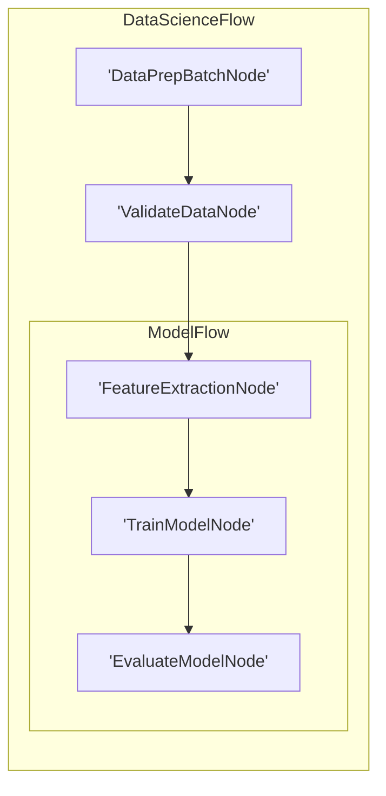

# Visualization and Debugging

Similar to LLM wrappers, we **don't** provide built-in visualization and debugging. Here, we recommend some _minimal_ (and incomplete) implementations These examples can serve as a starting point for your own tooling.

## 1. Visualization with Mermaid

This code recursively traverses the nested graph, assigns unique IDs to each node, and treats Flow nodes as subgraphs to generate Mermaid syntax for a hierarchical visualization.



```python
def build_mermaid(start):
    ids, visited, lines = {}, set(), ["graph LR"]
    ctr = 1
    def get_id(n):
        nonlocal ctr
        return ids[n] if n in ids else (ids.setdefault(n, f"N{ctr}"), (ctr := ctr + 1))[0]
    def link(a, b):
        lines.append(f"    {a} --> {b}")
    def walk(node, parent=None):
        if node in visited:
            return parent and link(parent, get_id(node))
        visited.add(node)
        if isinstance(node, Flow):
            node.start and parent and link(parent, get_id(node.start))
            lines.append(f"\n    subgraph sub_flow_{get_id(node)}[{type(node).__name__}]")
            node.start and walk(node.start)
            for nxt in node.successors.values():
                node.start and walk(nxt, get_id(node.start)) or (parent and link(parent, get_id(nxt))) or walk(nxt)
            lines.append("    end\n")
        else:
            lines.append(f"    {(nid := get_id(node))}['{type(node).__name__}']")
            parent and link(parent, nid)
            [walk(nxt, nid) for nxt in node.successors.values()]
    walk(start)
    return "\n".join(lines)
```



For example, suppose we have a complex Flow for data science:

```python
class DataPrepBatchNode(BatchNode):
    def prep(self,shared): return []
class ValidateDataNode(Node): pass
class FeatureExtractionNode(Node): pass
class TrainModelNode(Node): pass
class EvaluateModelNode(Node): pass
class ModelFlow(Flow): pass
class DataScienceFlow(Flow):pass

feature_node = FeatureExtractionNode()
train_node = TrainModelNode()
evaluate_node = EvaluateModelNode()
feature_node >> train_node >> evaluate_node
model_flow = ModelFlow(start=feature_node)
data_prep_node = DataPrepBatchNode()
validate_node = ValidateDataNode()
data_prep_node >> validate_node >> model_flow
data_science_flow = DataScienceFlow(start=data_prep_node)
result = build_mermaid(start=data_science_flow)
```

The code generates a Mermaid diagram:



## 2. Call Stack Debugging

It would be useful to print the Node call stacks for debugging. This can be achieved by inspecting the runtime call stack:

```python
import inspect

def get_node_call_stack():
    stack = inspect.stack()
    node_names = []
    seen_ids = set()
    for frame_info in stack[1:]:
        local_vars = frame_info.frame.f_locals
        if 'self' in local_vars:
            caller_self = local_vars['self']
            if isinstance(caller_self, BaseNode) and id(caller_self) not in seen_ids:
                seen_ids.add(id(caller_self))
                node_names.append(type(caller_self).__name__)
    return node_names
```

For example, suppose we have a complex Flow for data science:

```python
class DataPrepBatchNode(BatchNode):
    def prep(self, shared): return []
class ValidateDataNode(Node): pass
class FeatureExtractionNode(Node): pass
class TrainModelNode(Node): pass
class EvaluateModelNode(Node):
    def prep(self, shared):
        stack = get_node_call_stack()
        print("Call stack:", stack)
class ModelFlow(Flow): pass
class DataScienceFlow(Flow):pass

feature_node = FeatureExtractionNode()
train_node = TrainModelNode()
evaluate_node = EvaluateModelNode()
feature_node >> train_node >> evaluate_node
model_flow = ModelFlow(start=feature_node)
data_prep_node = DataPrepBatchNode()
validate_node = ValidateDataNode()
data_prep_node >> validate_node >> model_flow
data_science_flow = DataScienceFlow(start=data_prep_node)
data_science_flow.run({})
```

The output would be: `Call stack: ['EvaluateModelNode', 'ModelFlow', 'DataScienceFlow']`
